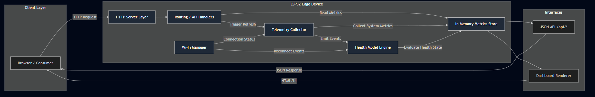
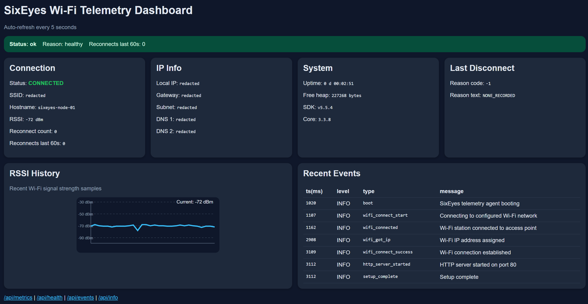

# Lightweight Edge Telemetry Agent for Constrained Devices - ESP32

ESP32-hosted Wi-Fi telemetry dashboard and lightweight HTTP APIs for local network observability.

<p align="center">
  
</p>

---


## Demo


## Overview

This project (SixEyes) is a lightweight edge telemetry agent for constrained devices.

Running on an ESP32, it provides real-time observability into device and network state, exposing structured telemetry via HTTP APIs and a minimal dashboard interface.

The system applies production-style observability concepts, health modelling, detailed event logging, and metric aggregation to embedded environments with constrained resources.


## Why This Exists
Most embedded projects expose functionality but lack structured observability.

SixEyes explores how telemetry and health monitoring can be applied to constrained edge devices, providing better visibility into system behaviour, reliability, and failure modes.

## What this demonstrates

- Designing a telemetry agent for constrained edge devices
- Building a health model (not just exposing metrics)
- Handling unreliable networks (reconnect tracking and rate analysis)
- Structuring observability into metrics, health, and event streams

---

## Features
- Real-time Wi-Fi telemetry dashboard  
- Lightweight HTTP API (`/api/*`)  
- Device health modelling and status evaluation  
- Core metrics: RSSI, uptime, free heap, reconnect count  
- Structured event logging (INFO / WARN / ERROR)  
- Connection health status banner
---
## Architecture  Concepts
This project follows a  pattern similar to node-level observability agents:
- Collect telemetry (Wi-Fi + system) 
- Obtain health state
- Expose structured APIs
- Provide dashboard

System patterns exist in:
- Datadog agents
- Prometheus exporters
- Sidecar telemetry agents

### Runtime Flow
<p align="center">
  
</p>

This diagram illustrates the end-to-end runtime flow, from browser interaction through the ESP32-hosted HTTP server, into telemetry collection, health evaluation, and finally the presentation layer (dashboard and API responses).

### Internal component architecture
<p align="center">
  
</p>

The lower-level architecture decomposes the runtime into logical components:
- HTTP routing
- Telemetry collection 
- health modelling
- state management
- in-memory metrics store

The above showcases seperation of concerns, and how telemetry data is actually transformed.

## Project Structure

- src/main.cpp – core telemetry agent
- /assets – dashboard images and diagrams

## Design Goals

This project is built with the following principles:

- Minimal footprint for constrained hardware  
- Clear separation of concerns between telemetry, health evaluation, and presentation  
- Explicit observability   
- Simplicity over completeness  
- Local-first operation without external dependencies  

## Design Decisions and Trade-offs
### HTTP over MQTT
**Rationale**
- simple browser-based access (low-effort)
- no broker dependency
- easy local network debugging
- natural fit for the  `/api/*` endpoints and dashboard rendering

**Trade-offs**
- no native pub/sub model
- not suitable for high-frequency telemetry streaming (aimed at small homelabs)
- external systems must poll the device for updates

### In-Memory Metrics Store

telemetry is stored in memory rather than persisted to flash or external storage.

**Rationale**
- minimalistic storage overhead
- avoids excessive flash writes
- runtime behaviour remains simple on constrained hardware

**Trade-offs**
- metrics are reset after reboot
- no long-term historical analysis
- external persistence would require another sink such as MQTT, CSV, or a db

### Polling over Push

The dashboard and APIs retrieve telemetry by polling the ESP32.

**Rationale**
- simpler client implementation 
- avoids long-lived socket management
- works well for low-frequency health monitoring

**Trade-offs**
- Repeated requests create overhead
- Not ideal for near-real-time event streaming
- Push-based updates would require WebSockets, Server-Sent Events, or MQTT

---
## Failure Handling

This project treats Wi-Fi instability and constrained device resources as first-class runtime concerns.

### Wi-Fi Reconnection

The device tracks Wi-Fi status and reconnect activity so degraded connectivity can be surfaced through telemetry rather than hidden from the user.

### Dropped Clients

HTTP requests are handled independently. If a browser disconnects or refreshes, the telemetry collection path remains unaffected.

### Heap Pressure

Free heap is exposed as a core metric to help detect memory pressure, fragmentation risk, or resource leaks over long-running sessions.

### Watchdog / Reset Awareness

Uptime is exposed so unexpected resets can be detected indirectly. A sudden drop in uptime indicates a reboot or device restart.

---
## Telemetry Schema
Table below summarises the metrics measured in this interface.
| Metric          | Type    | Description                 |
| --------------- | ------- | --------------------------- |
| RSSI            | int     | Wi-Fi signal strength (dBm) |
| free_heap       | bytes   | Available heap memory       |
| uptime          | seconds | Time since boot             |
| reconnect_count | int     | Wi-Fi reconnect attempts    |


---
## Metric Definitions
The following metrics are exposed by the system and used for health evaluation and observability.
| Metric | Meaning | Why it matters |
|---|---|---|
| RSSI | Defined as Received Signal Strength Indicator, measured in dBm. The higher, the better;e.g. `-45 dBm` is stronger than `-80 dBm`. | Indicates, the Wi-Fi signal quality as weak RSSI leads to packet loss, latency, or disconnections. |
| Free Heap | Available dynamic memory on the ESP32, measured in bytes. | Low free heap indicates memory pressure, leaks, or general instability. |
| Uptime | Time passed since the ESP32 last booted/reset. |  Identifies unexpected restarts, crashes, or power fluctuations |
| Reconnect Count | Total number of times the ESP32 has lost Wi-Fi connection and attempted to reconnect. | Useful for detecting unstable Wi-Fi, poor signal, router issues, or firmware reliability problems. |
| Reconnects Last 60s | Number of reconnect events observed within the last 60 seconds. | Identifies reconnect or repeated short-term network instability. |
| Wi-Fi Status | Current Wi-Fi state, such as `CONNECTED`, `DISCONNECTED`, or `CONNECT_FAILED`. | Provides the current connectivity state of the device. |
| Client IP / Local IP | The IP address assigned to the ESP32 on the local network. | Used to access the dashboard and API from a browser or HTTP client. |
| Gateway IP | The local router or gateway address used by the ESP32. | Helps confirm the ESP32 is connected to the expected network path. |
| Subnet Mask | Defines the local network range the ESP32 belongs to. | Useful for network troubleshooting and validating LAN configuration. |
| DNS Server | DNS resolver assigned to the ESP32. | Relevant if future features require hostname resolution or external service calls. |
| Last Disconnect Reason | ESP32 Wi-Fi disconnect reason code and label. | Helps diagnose why the device disconnected, such as authentication failure, beacon timeout, or access point loss. |
| Health Status | Derived status such as `ok`, `degraded`, or `down`. | Summarises multiple telemetry checks into a single operational state. |
| Firmware Version | Version string for the running firmware. | Supports release tracking, debugging, and reproducibility. |
| SDK/Core Version | ESP32 SDK and Arduino core version used by the firmware. | Helps diagnose compatibility issues across different ESP32 builds. |
---
## API Endpoints
Available endpoints exposed by the device:
| Endpoint | Method | Description |
|---|---|---|
| `/` | GET | Dashboard |
| `/api/metrics` | GET | Current telemetry snapshot |
| `/api/events` | GET | Recent events |
| `/api/health` | GET | Device health summary (refreshes every 5 secs) |
| `/api/info` | GET | Device/build metadata |

---

## Screenshots 

### Dashboard Preview
Real-time dashboard visualising device health and telemetry metrics.



### API Examples

Example responses from key endpoints.

### GET /api/metrics

```json
{
  "schema_version": "1.0",
  "device_id": "ESP32 WiFi Telemetry System",
  "timestamp_ms": 99977,

  "health": {
    "status": "ok",
    "reason": "healthy"
  },

  "wifi": {
    "connected": true,
    "status": "CONNECTED",
    "ssid": "<redacted>",
    "ip": "<redacted>",
    "gateway": "<redacted>",
    "subnet": "<redacted>",
    "dns1": "<redacted>",
    "dns2": "<redacted>",
    "rssi_dbm": -47,
    "reconnect_count": 0,
    "reconnects_last_60s": 0,
    "last_disconnect_reason_code": -1,
    "last_disconnect_reason_text": "NONE_RECORDED"
  },

  "system": {
    "uptime_ms": 99259,
    "uptime_human": "0d 00:01:39",
    "free_heap": 230388,
    "sdk_version": "v5.5.4",
    "core_version": "3.3.8"
  },

  "rssi_history": [
    -46, -46, -46, -49, -43, -47, -47, -44,
    -47, -44, -44, -44, -44, -44, -47, -44,
    -47, -48, -44, -48, -44, -47, -48, -48,
    -44, -44, -47, -44, -47
  ]
}


```


### GET /api/info

Returns static device and firmware metadata.

```json
{
  "project": "ESP32 WiFi Telemetry System",
  "firmware_version": "1.0.0",
  "hostname": "ESP32 WiFi Telemetry System",
  "mac_address": "XX:XX:XX:XX:XX:XX",
  "sdk_version": "v5.5.4",
  "core_version": "3.3.8",
  "static_ip_enabled": false
}
```

### GET /api/events

Returns recent system lifecycle and events.
```json
{
  "events": [
    {
      "ts_ms": 1020,
      "level": "INFO",
      "type": "boot",
      "message": "SixEyes telemetry agent booting"
    },
    {
      "ts_ms": 1107,
      "level": "INFO",
      "type": "wifi_connect_start",
      "message": "Connecting to Wi-Fi SSID: <redacted>"
    },
    {
      "ts_ms": 1141,
      "level": "INFO",
      "type": "wifi_connected",
      "message": "Wi-Fi station connected to access point"
    },
    {
      "ts_ms": 2831,
      "level": "INFO",
      "type": "wifi_got_ip",
      "message": "Wi-Fi got IP: <redacted>"
    },
    {
      "ts_ms": 3109,
      "level": "INFO",
      "type": "wifi_connect_success",
      "message": "Wi-Fi connection established"
    },
    {
      "ts_ms": 3112,
      "level": "INFO",
      "type": "http_server_started",
      "message": "HTTP server started on port 80"
    },
    {
      "ts_ms": 3113,
      "level": "INFO",
      "type": "setup_complete",
      "message": "Setup complete"
    }
  ]
}
```

### GET /api/health

Returns system health state, derived from telemetry data schema.
```json

{
  "status": "ok",
  "reason": "healthy",
  "checks": {
    "wifi_connected": true,
    "ip_assigned": true,
    "heap_ok": true,
    "weak_signal": false,
    "reconnect_storm": false
  },
  "metrics": {
    "uptime_ms": 93255,
    "free_heap": 230700,
    "rssi_dbm": -47,
    "reconnect_count": 0,
    "reconnects_last_60s": 0
  }
}


```


**Notes**
- All timestamps are in milliseconds since DEVICE BOOT
- RSSI values are reported in dBm
- Sensitive fields are redacted
- Health status derived from real-time telemetry as opposed to just static checks

---
## Setup
This project is designed to run on ESP32-based devices using the Arduino framework.

### Requirements

- ESP32 dev board
- USB Connection to host machine
- Arduino IDE
- ESP32 board support package installed


### Arduino IDE

1. Install Arduino IDE
2. Add ESP32 board support:
   - Open **Boards Manager**
   - Search for **esp32 by Espressif Systems**
   - Install latest version
3. Open project sketch in Arduino IDE

4. Configure credentials in the source file:

```cpp
static const char *WIFI_SSID = "your-wifi-ssid";
static const char *WIFI_PASSWORD = "your-wifi-password";
```

5. Configure demo-safe mode is enabled:
```cpp
static const bool EXPOSE_NETWORK_DETAILS = false;
```
Set to `true` only when debugging locally in a trusted network

6. Select the target board:
  - Tools → Board → ESP32 Arduino → ESP32 Dev Module
  - Or select the specific ESP32 variant you are using

7. Select serial port:
  - Tools → Port
  - Select COM/USB port for ESP32

8. Uplaod the firmware
  - Verify then Upload
  - Compilation and flashing to be completed

9. Open Serial Monitor , set baud rate

10. Find dashboard url in Serial Monitor:
```
Dashboard URL: http://xxxx.xxx.x.x
```
---

### Initialisation


On boot, the device will:
- connect to configured wifi network
- start http server
- start telemetry collection
- expose api endpoints under `/api/*`

---
## Security Notes

This project is designed for local development within trusted environments.

### Current Model

- Runs on local LAN only
- No authentication by default
- HTTP (no TLS)

### Important considerations
- **Do not expose directly to the internet!**
- No request validation or rate limiting is enforced
- API endpoints provide full device telemetry
- Sensitive fields may be exposed (IP, SSID, MAC)


### Recommended Usage

- use within isolated or private networks
- place behind a reverse proxy if external access is required
- restrict access via firewall rules or network segmentation

### Future improvements
Security is intentionally minimal to preserve simplicity on constrained hardware, but can be extended (see Future Work).

---
## Future Work
The following are being considered to evolve this into a more prod-ready edge telemetry system.

### Observability & Storage

- export to external sinks (e.g. Prometheus, MQTT, REST ingestion)
- historical metrics and trend analysis


### System Architecture

- Event classification (INFO / WARN / ERROR)
- Structured event pipeline
- Improved health modelling and state transitions (HEALTHY / DEGRADED / UNHEALTHY)

### Networking & Interfaces

- Push-based telemetry (WebSockets / SSE / MQTT)
- Configurable polling intervals
- API versioning and schema evolution

### Security

- Basic authentication (token or API key)
- Optional TLS termination via proxy
- Access control for API endpoints

### Device Management

- Firmware update support
- Remote configuration management
- Device identification and multi-device aggregation

These improvements are intentionally scoped to for feature growth considering the constraints of embedded hardware.